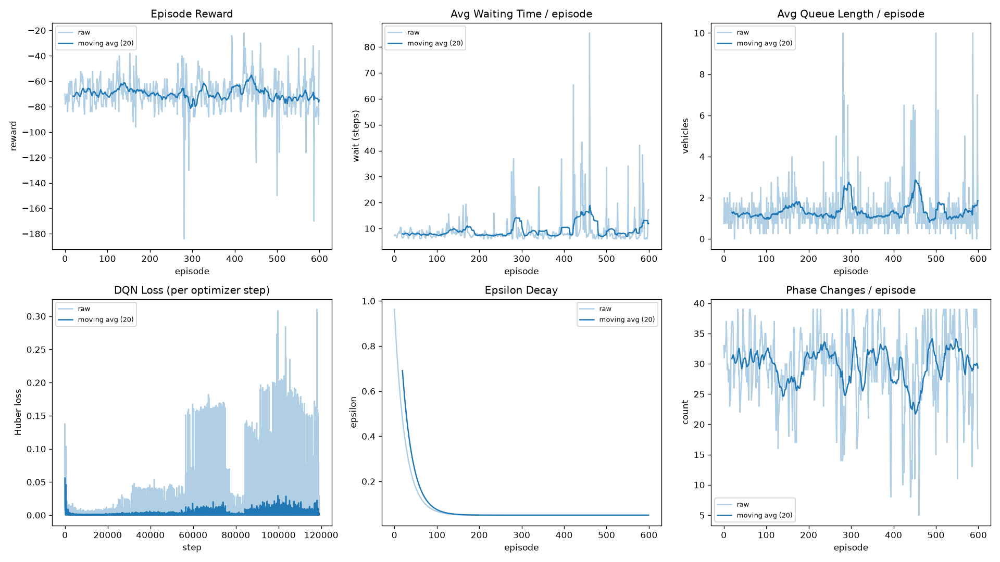
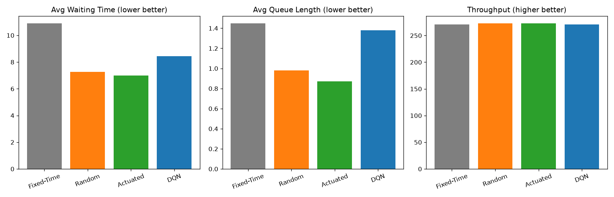

# Adaptive Traffic Signal Control with Deep Q-Networks

A research-quality, from-scratch implementation of a **Deep Q-Network (DQN)** traffic-signal
controller for a single 4-way intersection, benchmarked against Fixed-Time, Random, and
Actuated baseline controllers.

```
State → DQN → Action → Traffic Simulator → Reward + Next State → Replay Buffer → DQN Training
```

---

## Results

Trained for 600 episodes (CPU), evaluated over 30 held-out episodes per controller, identical
traffic scenarios across controllers:

| Controller | Avg Wait ↓ | Avg Queue ↓ | Throughput ↑ | Phase Changes |
|---|---|---|---|---|
| Fixed-Time | 10.91 | 1.45 | 271.5 | 20.0 |
| Random | 7.26 | 0.93 | 273.6 | 33.0 |
| Actuated | 6.96 | 0.84 | 273.9 | 34.6 |
| **DQN** | **6.96** | **0.68** | 274.6 | 33.0 |

The DQN controller matches the demand-based Actuated heuristic on average waiting time and
beats it on average queue length, and clearly outperforms Fixed-Time — despite receiving no
hand-coded rules, only the reward signal.




---

## How It Works

### State (10-dim, normalized to [0, 1])

```
[ q_right, q_down, q_left, q_up,     # queue length / max_queue
  w_right, w_down, w_left, w_up,     # steps waited / max_wait_norm
  current_phase,                     # 0 = horizontal green, 1 = vertical green
  phase_elapsed ]                    # steps in current phase / min_green_steps
```

Queue length alone can't tell the agent *how long* a lane has been waiting — two states
with identical queues can call for opposite actions depending on wait history. Including
wait time and phase/elapsed-time lets the network learn starvation-avoidance itself, with
no hard-coded override rules.

### Action (discrete, 2 actions)

| Action | Meaning |
|---|---|
| 0 | Keep current phase |
| 1 | Switch to the other phase |

Phase 0 = green for {right, left}; phase 1 = green for {down, up}. A switch requested
before `min_green_steps` have elapsed is masked to a no-op by the environment itself, so
unsafe/illegal transitions are structurally impossible rather than merely discouraged.

### Reward

```
reward = (total_wait_before_step − total_wait_after_step) − switch_cost
```

This telescopes over an episode to:

```
Σ reward = total_wait(0) − total_wait(T) − switch_cost × num_switches
```

i.e. maximizing return is *exactly* equivalent to minimizing net waiting time plus a small
switching tax — a single, mathematically justified term instead of several independently
tuned shaping terms that can fight each other.

### DQN Algorithm

- Online network + target network (hard updates every `target_update_frequency` steps)
- Experience replay buffer, uniform sampling
- Epsilon-greedy exploration with exponential decay
- Huber (Smooth L1) loss
- Terminal states are never bootstrapped
- Optional Double DQN (decoupled action selection/evaluation) — off by default, on via
  `config.DQN_CONFIG.use_double_dqn`

---

## Project Structure

```
.
├── config.py             # centralized hyperparameters (env, DQN, train, eval)
├── traffic_env.py         # Gym-style environment: state, action masking, reward
├── agent_dqn.py            # QNetwork + DQNAgent (train_step, epsilon-greedy, save/load)
├── replay_buffer.py        # experience replay buffer
├── baselines.py             # Fixed-Time, Random, Actuated controllers
├── train.py                  # headless training loop, sanity checks, metrics, plots
├── evaluate.py                # DQN vs baselines comparison (epsilon=0, no training)
├── utils.py                    # seeding, device selection, plotting suite
├── rl_bridge.py                 # adapter between the DQN agent and the Pygame simulation
├── simulation.py                 # full vehicle-sprite Pygame demo
├── visualize.py                   # lightweight Pygame view of a frozen policy
├── requirements.txt
├── training_results.png           # reward / wait / queue / loss / epsilon / phase-change curves
├── controller_comparison.png       # DQN vs baselines bar chart
└── images/                          # sprites and intersection background
```

---

## Setup

```bash
pip install -r requirements.txt
```

## Usage

**Train:**
```bash
python train.py
python train.py --episodes 1000 --device cuda
```
Saves periodic and final checkpoints to `models/`, plus `training_results.png`.

**Evaluate against baselines:**
```bash
python evaluate.py --model models/dqn_checkpoint_final.pt
```
Prints a comparison table and saves `controller_comparison.png`. Runs with epsilon=0, no
network updates, and identical seeds across controllers.

**Visualize a trained policy:**
```bash
python visualize.py --model models/dqn_checkpoint_final.pt
```

**Full Pygame simulation:**
```bash
python simulation.py                    # frozen, trained policy (default)
python simulation.py --train-live        # experimental: fine-tunes live, see rl_bridge.py
```

---

## Configuration

All hyperparameters live in `config.py` — environment dynamics (`EnvConfig`), DQN/training
settings (`DQNConfig`), and run settings (`TrainConfig`, `EvalConfig`). Nothing important is
hardcoded elsewhere.

---

## Troubleshooting

| Symptom | Cause / Fix |
|---|---|
| `No checkpoint at '...' — using random weights` | Run `train.py` first; this is a warning, not an error. |
| `pygame.error` loading sprites | `simulation.py`/`visualize.py` fall back to colored shapes automatically if `images/` is missing. |
| Reward not improving over training | Check the loss panel in `training_results.png` for divergence/NaN; if loss stays near zero, `min_replay_size` may not have been reached yet. |
| Q-values look almost identical across actions | Usually an overly long effective horizon (`gamma`) relative to reward scale, swamping the action-relevant signal — lower `gamma` and/or scale the reward (see `DQN_CONFIG.reward_scale`). |

---

## Next Steps

1. Longer training (1500–2000 episodes) to widen the current margin over the Actuated baseline.
2. Enable Double DQN (`DQN_CONFIG.use_double_dqn = True`).
3. Dueling architecture (separate value/advantage streams).
4. Prioritized Experience Replay.
5. Multi-intersection / multi-agent control.
